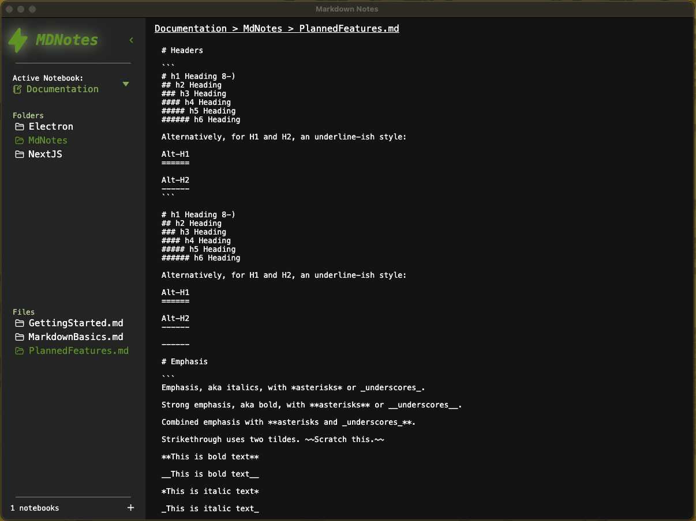

# MDNotes

A modern, cross-platform desktop markdown editor built with Electron, React, and TypeScript. MDNotes provides an intuitive notebook-based organization system for managing your markdown files with a clean, distraction-free interface.

## Features

### 📁 Hierarchical Organization
- **Notebook → Folder → Page** structure for logical content organization
- Context menus for quick actions (create, delete)
- Collapsible navigation sidebar

### ✏️ Markdown Editing
- Real-time markdown editing
- Auto-save functionality with visual save status indicators
- Tab support for proper indentation
- Keyboard shortcuts for common actions

### 🎨 Modern Interface
- Clean, minimalist design focused on content
- Resizable navigation panel
- Breadcrumb navigation for easy file location
- Responsive layout that adapts to your workflow

### ⌨️ Keyboard Shortcuts
- `Cmd/Ctrl + S` - Save current file
- `Cmd/Ctrl + N` - Toggle navigation panel
- `Tab` - Insert tab character (with proper indentation)

### 🚀 Cross-Platform
- Available for macOS, Windows, and Linux
- Native desktop application experience
- Consistent interface across all platforms

## Screenshot



## Installation

### Prerequisites
- Node.js (v18 or higher)
- npm or yarn package manager

### Development Setup

1. **Clone the repository**
   ```bash
   git clone <repository-url>
   cd markdown-editor
   ```

2. **Install dependencies**
   ```bash
   npm install
   ```

3. **Start development server**
   ```bash
   npm run dev
   ```

### Building for Distribution

Build for your target platform:

```bash
# macOS (ARM64 + x64)
npm run dist:mac

# Windows (x64)
npm run dist:win

# Linux (x64)
npm run dist:linux
```

## Usage

### Getting Started
1. Launch MDNotes
2. Create your first notebook using the "+" button in the navigation panel
3. Add folders to organize your content
4. Create markdown files and start writing

### File Organization
- **Notebooks**: Top-level containers for your projects or topics
- **Folders**: Organize related content within notebooks
- **Pages**: Individual markdown files for your notes

### Navigation
- Use the sidebar to navigate between notebooks, folders, and files
- Click and drag the divider to resize the navigation panel
- Use breadcrumbs to quickly navigate to parent directories

## Technology Stack

- **Frontend**: React 19 with TypeScript
- **Desktop Framework**: Electron 35
- **Styling**: SCSS with modern CSS features
- **Build Tool**: Vite for fast development and building
- **Package Management**: npm with comprehensive dependency management

## Development

### Project Structure
```
src/
├── electron/          # Electron main process
├── ui/               # React application
│   ├── components/   # Reusable UI components
│   ├── contexts/     # React contexts for state management
│   ├── hooks/        # Custom React hooks
│   └── styles/       # SCSS stylesheets
```

### Available Scripts
- `npm run dev` - Start development environment
- `npm run build` - Build for production
- `npm run lint` - Run ESLint
- `npm run preview` - Preview production build

## Contributing

1. Fork the repository
2. Create a feature branch (`git checkout -b feature/amazing-feature`)
3. Commit your changes (`git commit -m 'Add amazing feature'`)
4. Push to the branch (`git push origin feature/amazing-feature`)
5. Open a Pull Request

## License

This project is licensed under the MIT License - see the LICENSE file for details.

## Support

For issues, feature requests, or questions, please open an issue on the GitHub repository.